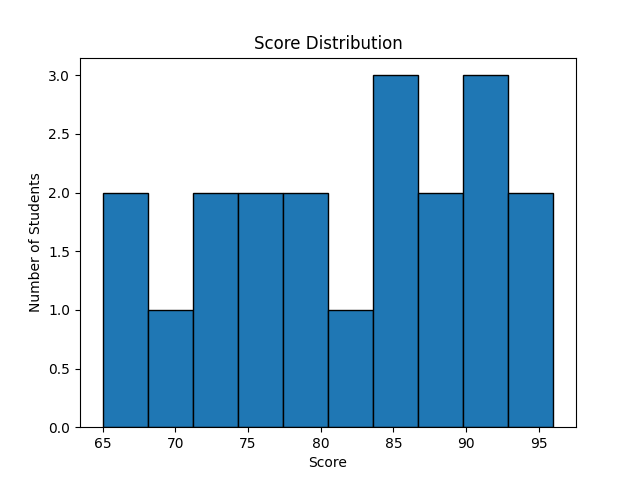
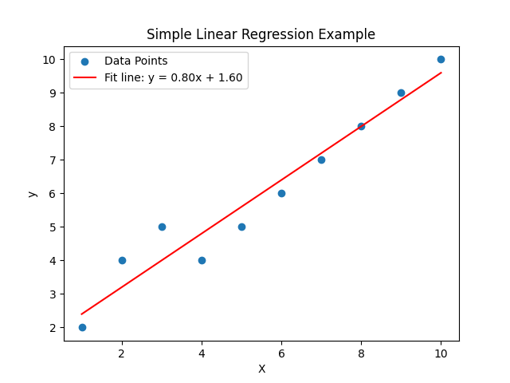

# 统计建模体验营项目

## 项目背景

在高三期间，参加了学校举办的“统计建模体验营”。这次活动面向对数据科学感兴趣的学生，通过真实的统计建模实践，让我们初步了解数据分析的基本流程、常用工具和可视化方法。在营队中，我第一次使用 Python，并用它绘制了考试成绩分布直方图，这成为我对数据科学兴趣的起点。

## 项目内容

### 成绩分布直方图（histogram.py）

- 使用 `matplotlib` 读取一组模拟的考试成绩数据。
- 将成绩区间划分为若干区间，绘制直方图展示成绩分布情况。
- 生成图片 `score_histogram.png` 作为可视化结果。

### 描述性统计分析（descriptive_stats.py）

- 使用 `numpy` 计算同一组成绩数据的均值、中央値和标准差。
- 通过打印结果帮助理解数据集中趋势和离散程度。

### 简单线性回归示例（linear_regression_example.py）

- 构造一组简单的二维数据，使用 `numpy.polyfit` 进行线性拟合。
- 绘制散点图和拟合直线，并保存为 `linear_regression_example.png`。
- 用于演示回归分析的基础概念和可视化方法。

## 使用方法

在本地环境中安装所需的 Python 库（如 `matplotlib` 和 `numpy`）后，可运行各个脚本：

```
python3 histogram.py
python3 descriptive_stats.py
python3 linear_regression_example.py
```

每个脚本运行后将在当前目录生成相应的图片文件或打印统计信息。

## 实现要求与方法

- 使用 Python 3，并安装 `matplotlib` 和 `numpy` 等科学计算库。
- 在 `histogram.py` 中定义一组模拟的考试成绩数据，通过调整区间数量并调用 `hist` 函数绘制成绩直方图。
- 在 `descriptive_stats.py` 中使用 NumPy 的 `mean`、`median` 和 `std` 计算均值、中位数和标准差。
- `linear_regression_example.py` 使用 NumPy 的 `polyfit` 对简单二维数据进行一次线性回归，得到斜率和截距，并使用 Matplotlib 绘制散点和拟合直线。

## 项目演示结果

- **成绩分布直方图**：直方图展示大部分同学的成绩集中在 70–90 分区间，少数同学得分高于 90，总体可视化反映了成绩分布情况。
- **描述性统计分析**：运行 `descriptive_stats.py` 之后计算的平均分约 81.08 分、中位数约 81.50 分、标准差为 9.4 分，这些指标表明整体成绩居中且分布有一定波动。
- **线性回归示例**：线性回归脚本利用观察到的散点给出了趋势线 `y ≈ 0.8x + 1.6`，散点与这条线的整体关系较紧密，示例演示了如何利用简单模型描述变量关系。

#### 演示图片





## 代码说明与意义

- `histogram.py`：通过绘制直方图，让同学们会用图形方式直观地了解成绩分布，体会可视化在数据分析中的作用。
- `descriptive_stats.py`：介绍如何使用 `numpy` 快速计算常用统计指标，帮助理解数据的集中趋势与离散程度。
- `linear_regression_example.py`：展示了一元线性回归的基本思想，通过绘制散点与拟合直线示意回归关系，为以后深入学习机器学习奠定基础。

## 进一步扩展

除了这些示例外，项目可以继续拓展我们在营队中学到的小项目，例如：

- **相关性分析**：探索不同科目成绩之间的相关关系。
- **聚类分析**：将学生按兴趣或学习特征分成不同群体。
- **时间序列预测**：用历史成绩数据预测未来趋势。

未来可以继续加入新的分析脚本和实践笔记，记录学习成果。